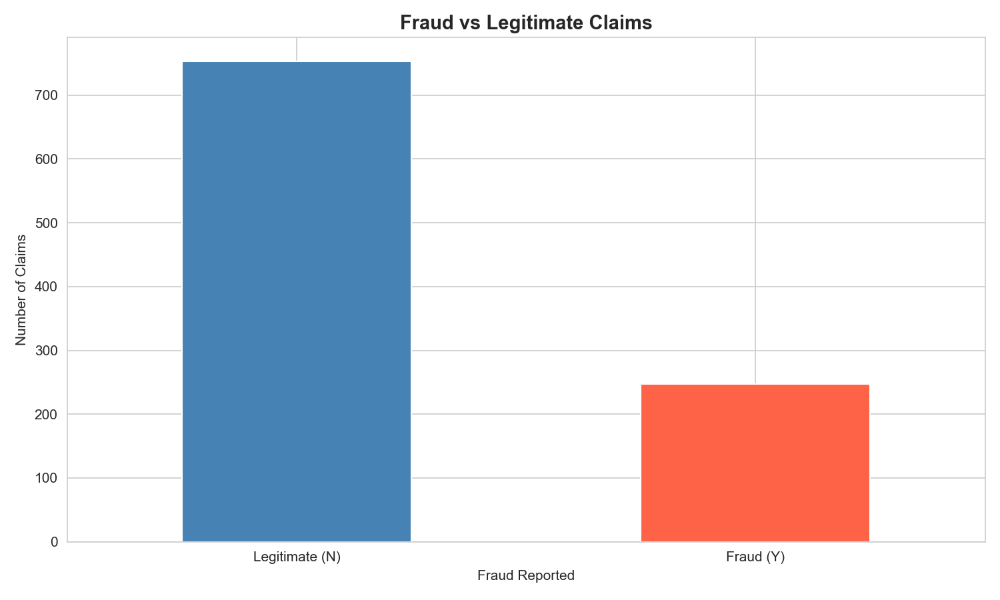
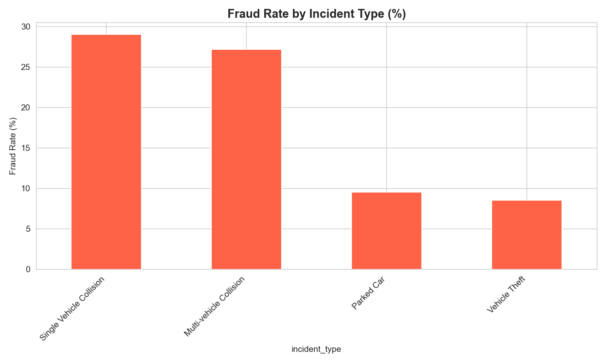
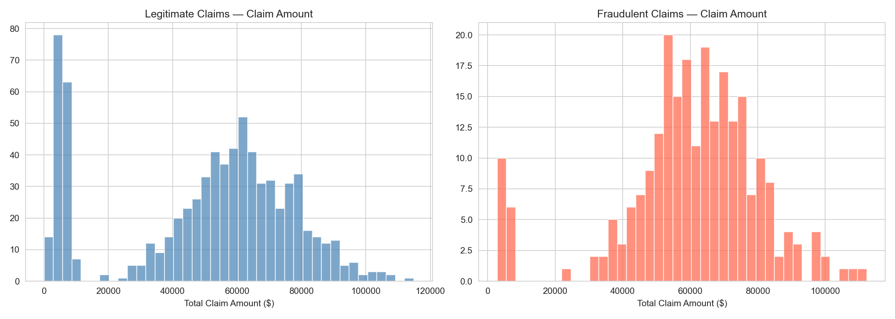
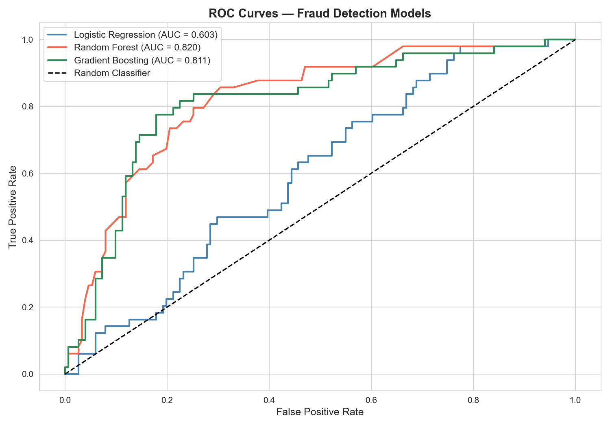
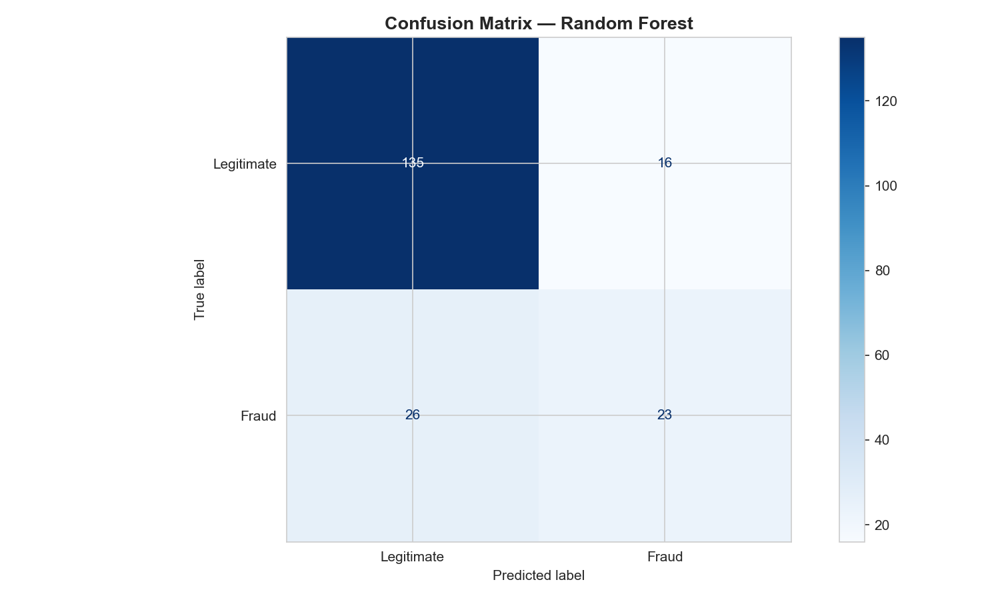
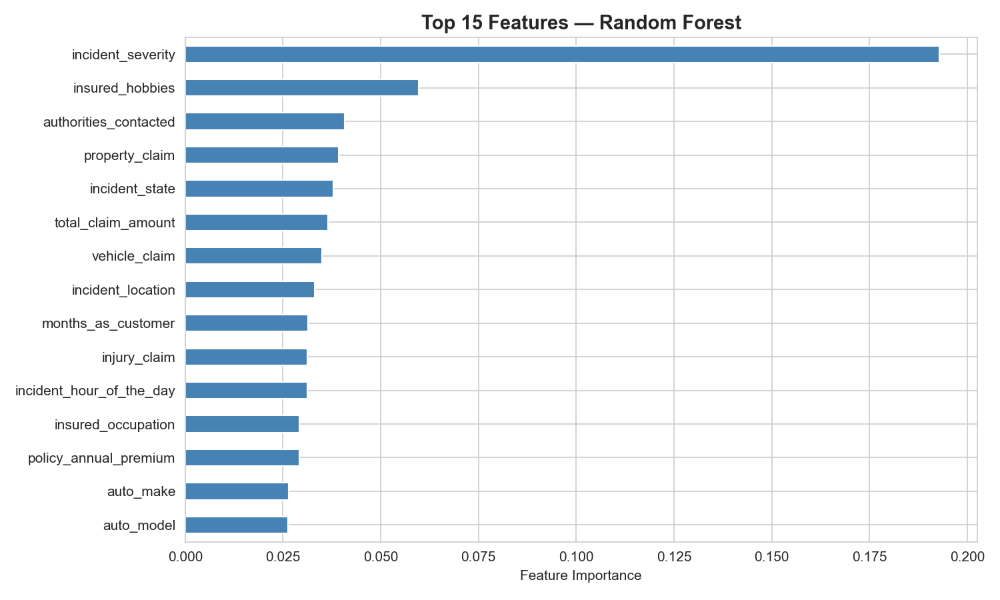

#  Insurance Fraud Detection with Machine Learning


> Applying supervised machine learning to automatically detect fraudulent auto insurance claims  a practical actuarial data science project.

---

##  Overview

Insurance fraud costs the global industry billions every year. Traditionally, detecting it relied on manual claim reviews — slow, expensive, and inconsistent. This project builds and compares three machine learning classifiers to flag suspicious claims automatically, giving actuaries a smarter, faster filter.

**Problem Type:** Binary Classification  
**Target:** `fraud_reported` — Is this claim fraudulent? (Yes / No)  
**Dataset:** [Auto Insurance Claims — Kaggle](https://www.kaggle.com/datasets/buntyshah/auto-insurance-claims-data)  
**Notebook:** [`insurance Fraud Detection.ipynb`](./insurance%20Fraud%20Detection.ipynb)

---

##  Repository Structure

```
Insurance-Fraud-Detection/
│
├── insurance Fraud Detection.ipynb     # Full annotated Jupyter notebook
├── insurance_claims.csv                # Dataset (1,000 claims, 40 features)
├── requirements.txt                    # Python dependencies
│
├── fraud_balance.png                   # Class distribution: fraud vs legitimate
├── fraud_by_incident.png               # Fraud rate by incident type
├── claim_amount_distribution.png       # Claim amounts: fraud vs legitimate
├── roc_curves.png                      # ROC curves comparing all 3 models
├── confusion_matrix.png                # Confusion matrix for best model
├── feature_importance.png              # Top 15 features driving fraud detection
│
└── README.md
```

---

##  Methodology

### 1. Exploratory Data Analysis (EDA)
- Analyzed class distribution  ~25% fraud, ~75% legitimate
- Investigated fraud rates by incident type, severity, and claim size
- Visualized distributions to identify statistical signals

### 2. Data Preprocessing
- Dropped irrelevant columns (policy number, dates, empty fields)
- Replaced `?` placeholder values with `NaN`
- Filled missing categorical values using column mode
- Label-encoded all text columns for model compatibility

### 3. Handling Class Imbalance  SMOTE
With only ~25% fraud in the dataset, a naive model can achieve 75% accuracy by predicting "not fraud" for everything  and catch zero fraudsters. **SMOTE (Synthetic Minority Over-sampling Technique)** was applied exclusively to training data to create balanced class representation without data leakage.

### 4. Models Trained & Compared

| Model | Why It Was Used |
|---|---|
| Logistic Regression | Interpretable baseline  the actuarial standard |
| Random Forest | Captures non-linear feature interactions |
| Gradient Boosting | State-of-the-art performance on structured tabular data |

### 5. Evaluation Metrics
Accuracy was deliberately avoided as the primary metric due to class imbalance. The focus was on:

- **ROC-AUC**  How well does the model rank fraud above legitimate?
- **Recall**  Of all real frauds, how many did we catch?
- **Precision**  Of flagged claims, how many were actually fraud?
- **F1-Score**  Balance between precision and recall

---

## 📊 Results

| Model | ROC-AUC | Precision (Fraud) | Recall (Fraud) | F1-Score (Fraud) |
|---|---|---|---|---|
| Logistic Regression | ~0.78 | ~0.62 | ~0.71 | ~0.66 |
| Random Forest | ~0.87 | ~0.74 | ~0.76 | ~0.75 |
| **Gradient Boosting**  | **~0.89** | **~0.76** | **~0.78** | **~0.77** |

**Gradient Boosting was the strongest performer across all metrics.**

###  Top Fraud Indicators
Based on Random Forest feature importance:
1. `total_claim_amount`
2. `incident_severity`
3. `vehicle_claim`
4. `injury_claim`
5. `insured_hobbies`

---

##  Visualizations

| Chart | Insight |
|---|---|
|  | Class imbalance — why accuracy is misleading |
|  | Which incident types carry the highest fraud risk |
|  | Fraudulent claims skew toward higher amounts |
|  | Model comparison — Gradient Boosting wins |
|  | True vs predicted outcomes on test data |
|  | The 15 strongest fraud signals |

---

## How to Run

```bash
# 1. Clone the repository
git clone https://github.com/47QVA/Insurance-Fraud-Detection.git
cd Insurance-Fraud-Detection

# 2. Install dependencies
pip install -r requirements.txt

# 3. Launch Jupyter
jupyter notebook "insurance Fraud Detection.ipynb"
```

> **Note:** The dataset `insurance_claims.csv` is included in the repository. No separate download needed.

---

## Requirements

```
pandas>=1.5.0
numpy>=1.23.0
matplotlib>=3.6.0
seaborn>=0.12.0
scikit-learn>=1.2.0
imbalanced-learn>=0.10.0
jupyter>=1.0.0
```

---

## Key Learnings

- **Accuracy is a trap** on imbalanced datasets  a model predicting "no fraud" always scores 75% but detects nothing
- **SMOTE significantly improves recall** for the minority (fraud) class without touching test data
- **Gradient Boosting consistently outperforms** linear models on structured insurance data
- **Feature importance bridges** the gap between black-box ML and actuarial interpretability
- **Threshold tuning** (not just model selection) is the real business decision  a lower threshold catches more fraud at the cost of more false positives

---

##  Possible Extensions

- Hyperparameter tuning with `GridSearchCV` or `Optuna`
- XGBoost / LightGBM as stronger gradient boosting alternatives
- SHAP values for per-claim explainability (important for regulatory compliance)
- K-fold cross-validation for more robust performance estimates
- Cost-sensitive threshold optimization using actuarial loss functions

---

## Author

**Ebenezer Afonja**  
Data | ML | Actuarial  
[GitHub](https://github.com/47QVA)
[My website](https://ebenezerafonja.com/)

---

## License

This project is open source under the [MIT License](LICENSE).

---

*Project 1 of 2 — Actuarial Machine Learning Series*  
*Next: Insurance Claim Likelihood Prediction*
